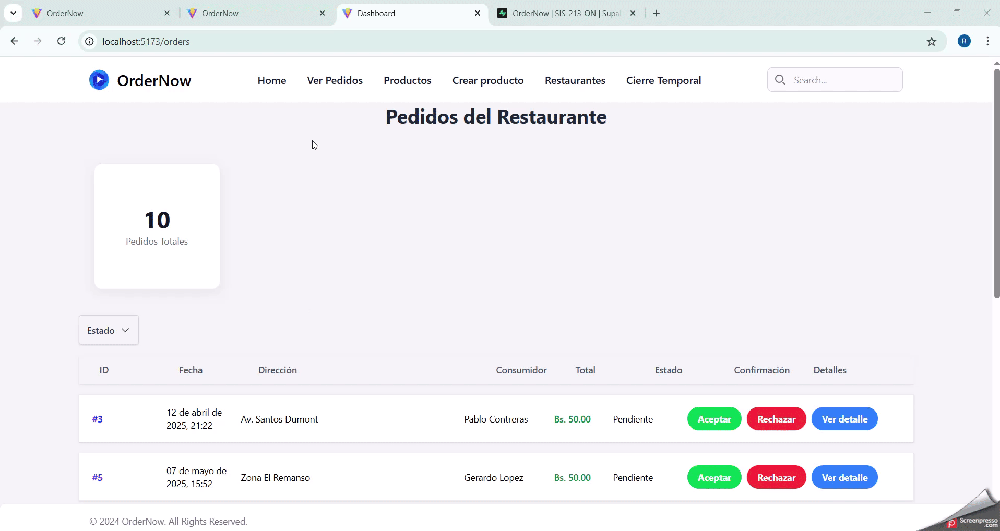
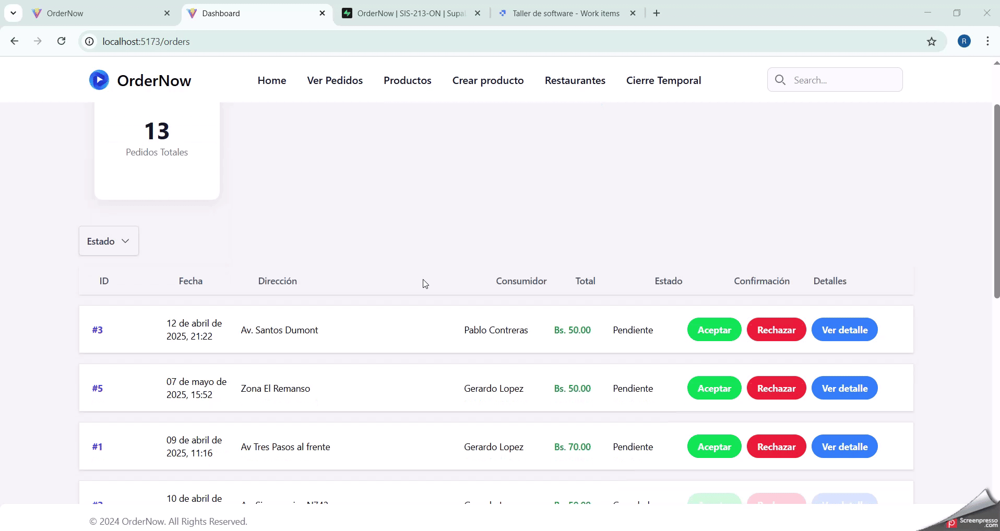

# Wiki del Proyecto: \[Nombre del Proyecto]

## Índice

1. [Introducción](#introducción)
2. [Análisis de Requisitos](#análisis-de-requisitos)
3. [Diseño del Sistema](#diseño-del-sistema)
4. [Implementación](#implementación)
5. [Pruebas](#pruebas)
6. [Gestión del Proyecto](#gestión-del-proyecto)
7. [Anexos](#anexos)

---

## Introducción

### Descripción general del sistema
El sistema **OrderNow** se encarga de un flujo completo de la realización de un pedido, que conlleva desde la perspectiva del consumidor hasta la entrega del pedido por un repartidor. Este mismo proporciona herramientas para el negocio para los distintos usuarios interesados y mejora la comunicación entre ellos.
### Objetivo General
Implementar una aplicación web para solventar los problemas de espera y de organización al momento de pedir comida desde la Universidad Católica Boliviana.
### Objetivos específicos
* Integración de los distintos restaurantes al frente de la universidad en una sola aplicación.
* Analizar la situación actual de los estudiantes, los coordinadores restaurantes y los repartidores.
* Mejorar el tiempo de espera al momento de pedir un producto
* Lograr un mejor uso de los recursos monetarios para los distintos tipos de usuario de la aplicación.
* Aumentar la cantidad de negocios establecidos para que los estudiantes tengan mas opciones al momento de escoger su comida.
### Alcance
El presente proyecto incluye solamente las operaciones relacionadas con un pedido, que conlleva desde la creación de un pedido por un consumidor hasta la entrega por un repartidor desde una aplicación web. Además de que la atención será centrada a los restaurantes al frente de la Universidad Católica Boliviana 
### Stakeholders
* Estudiantes, docentes y personal de la Universidad Católica Boliviana
* Restaurantes al frente de la Universidad Católica Boliviana
* Repartidores de comida que vivan cerca o se beneficien de la construcción de la aplicación.
### Glosario de términos
**Scrum:** Scrum es un marco ágil utilizado en la gestión de proyectos para facilitar el trabajo en equipo y la entrega de valor de forma eficiente y flexible.  
**Sprint:** Un sprint es un período breve de tiempo fijo en el que un equipo de scrum trabaja para completar una cantidad de trabajo establecida.  
**Spike:** Es un tipo de elemento de trabajo que se utiliza cuando un equipo necesita investigar, explorar o experimentar para comprender mejor un problema antes de comprometerse con una solución.  
**UML:** Es un lenguaje de modelado estándar que se utiliza para visualizar, especificar y documentar los artefactos de un sistema, especialmente de software, mediante diagramas.  
**Wireframe:** Un wireframe es un diagrama visual que esboza el esqueleto de un proyecto o pieza tecnológica.  
**Mockup:** Representación visual de un diseño, que simula cómo lucirá en la realidad, generalmente antes de que se implemente o se produzca el producto final.  
**Parse:** Analizar o descomponer una cadena de texto o datos en componentes más pequeños para identificar su estructura y extraer información significativa.  
**Patron de diseño:** Solución predefinida a un problema común en el diseño de software.  
**Facade:** Facade es un patrón de diseño estructural que se utiliza para simplificar la interacción entre diferentes componentes de un sistema.  

---

## Análisis de Requisitos

### Historias de usuario separadas por sprint trabajadas
- Sprint 1
    - [Spike: Expo router](http://159.69.123.44/isw/browse/TALLE-3/)
    - [Spike: Supabase](http://159.69.123.44/isw/browse/TALLE-4/)
    - [Spike: Docker](http://159.69.123.44/isw/browse/TALLE-5/)
    - [Spike: Figma Tailwind Template](http://159.69.123.44/isw/browse/TALLE-6/)
- Sprint 2
    - [Base de datos con Supabase - Solo lectura / Sin RLS restrictiva](http://159.69.123.44/isw/browse/TALLE-32/)
- Sprint 3
    - [Creacion de la aplicación del dashboard]()
    - [Carrito](http://159.69.123.44/isw/browse/TALLE-33/)
- Sprint 4
    - [Detalle Pedido](http://159.69.123.44/isw/browse/TALLE-143/)
- Sprint 5
    - [Rechazar pedido](http://159.69.123.44/isw/browse/TALLE-147/)
    - [Aceptar pedido](http://159.69.123.44/isw/browse/TALLE-146/)
    - [Registrar un producto](http://159.69.123.44/isw/browse/TALLE-154/)
    - [Modificar/Actualizar producto](http://159.69.123.44/isw/browse/TALLE-156/)
- Sprint 6
    - [Notificación del pedido](http://159.69.123.44/isw/browse/TALLE-69/)
- Sprint 7
    - [Filtrar pedido por estado](http://159.69.123.44/isw/browse/TALLE-339/)
    - [Tabla de restaurantes](http://159.69.123.44/isw/browse/TALLE-340/)
    - [Tabla de productos](http://159.69.123.44/isw/browse/TALLE-341/)
- Sprint 8
    - [Editar Restaurante](http://159.69.123.44/isw/browse/TALLE-352/)
    - [Obtener datos del restaurante](http://159.69.123.44/isw/browse/TALLE-346/)
    - [Obtener los productos de un restaurante](http://159.69.123.44/isw/browse/TALLE-345/)

---

## Diseño del Sistema

### Diagrama de la Arquitectura general a implementar según el estado actual del proyecto (diagrama + explicación)

  
La aplicación consiste en dos proyectos principales que son:
- OrderNow-React: Es el proyecto que se centra en las operaciones de un consumidor en la aplicación.
Este proyecto es el que contiene dependencias de muchas tecnologías y es la mas refinada de todo el proyecto.
- OrderNow-Dashboard: Este proyecto completa el flujo principal del negocio, haciendo posible la monitorización y gestión de pedidos de un restaurante. Además de contener el sector administrador para manejar a todos los restaurantes registrados de la aplicación.

### Diagrama de Modelo entidad-relación (ER) tipo UML


### Diseño de interfaces de usuario por página(mockups, wireframes)    
- Carrito  
    
- Dashboard de pedidos
     - Modal de confirmación  
      
    
    - Modal del detalle de un pedido    
      
    
    - Filtrar pedido por estado  
      
- Registro producto
    - Registrar producto  
    
    - Actualizar producto  
    
- Tabla de restaurantes y productos  
      
    
---

## Implementación

- [Repositorio de Github](https://github.com/ucb-scz-dims/SIS-213-ON.git)
- [Tablero del Proyecto en Plane](http://159.69.123.44/isw/projects/323b25a8-5981-4168-b11d-3f5024224d09/issues)

### Tecnologías utilizadas individualmente
- React
- Supabase
- Figma
- Excalidraw
- Git/Github
- PostgreSQL
### Explicar un patrón de diseño que se puede implementar en el proyecto

#### Problematica

En la actualidad existe un gran acoplamiento entre los componentes responsables de la vista de la aplicación y los responsables de la lógica que maneja la aplicación. Por ejemplo, en la aplicación del **Dashboard** se se tiene un componente llamado **OrderDashboard.jsx** que contiene **239** lineas de código. Este componente esta conformado por:
- Logica para manejar el modal de confirmación
- Solicitud de varias tablas a la base de datos
- Parse de los datos consultados
- Presentación de la interfaz de usuario

Este componente tiene multiples responsabilidades con el paso de tiempo seguirá creciendo hasta volverse inmantenible.

```jsx
const supaBase = getSupaBaseClient();
const filterService = new FilterService();

const OrdersDashboard = () => {
  const [orders, setOrders] = useState([]);
  const [loading, setLoading] = useState(true);
  const [isDetailModalOpen, setDetailModalOpen] = useState(false);

  const [isConfirmationModalOpen, setConfirmationModalOpen] = useState(false);
  const [selectedOrderId, setSelectedOrderId] = useState(null);
  const [confirmAction, setConfirmAction] = useState(null);
  const [titleConfirmationModal, setTitleConfirmationModal] = useState("");
  const [bodyConfirmationModal, setBodyConfirmationModal] = useState("");
  const [seletedStatusFilters, setSeletedStatusFilters] = useState([]);
  const isUpdating = useRef(false);
  const ordersRef = useRef([]);

  const closeDetailModal = () => setDetailModalOpen(false);
  const closeConfirmationModal = () => setConfirmationModalOpen(false);

  const openDetailModal = (orderId) => {
    setSelectedOrderId(orderId);
    setDetailModalOpen(true);
  };

  const openConfirmationModal = (orderId, newStatusId) => {
    if (newStatusId == ORDER_STATUS.CANCELED) {
      setTitleConfirmationModal("Rechazar pedido");
      setBodyConfirmationModal("¿Estás seguro de rechazar el pedido?");
    } else {
      setTitleConfirmationModal("Aceptar pedido");
      setBodyConfirmationModal("¿Estás seguro de aceptar el pedido?");
    }

    setSelectedOrderId(orderId);
    setConfirmAction(newStatusId);
    setConfirmationModalOpen(true);
  };

  const handleOrderStatusChange = async () => {
    if (!selectedOrderId || !confirmAction)
      return;

    if (isUpdating.current)
      return

    isUpdating.current = true;
    const { error } = await supaBase
      .schema("com")
      .from("orders")
      .update({ state_type_id: confirmAction })
      .eq("id", selectedOrderId);

    if (error) {
      isUpdating.current = false;
      alert("Error al actualizar el estado. Intentalo otra vez.");
      console.log(error.message);
      return;
    }

    await fetchOrders();
    closeConfirmationModal();

    isUpdating.current = false;
  };

  const fetchOrders = async () => {
    const { data: ordersData, error: ordersError } = await supaBase
      .schema("com")
      .from("orders").select(`
        id,
        date,
        address,
        total_price,
        consumer_id,
        state_type_id,
        state_types ( name )
      `);

    const { data: consumerData, error: consumerError } = await supaBase
      .schema("com")
      .from("consumers").select(`
        id,
        user_id
      `);

    const { data: usersData, error: usersError } = await supaBase
      .schema("sec")
      .from("users").select(`
          id,
          name,
          last_name
          `);

    if (ordersError || usersError || consumerError) {
      return console.error("Error fetching data:", ordersError || usersError);
    }

    const enrichedOrders = ordersData.map((order) => {
      const consumer = consumerData.find((c) => c.id === order.consumer_id);
      const user = consumer
        ? usersData.find((u) => u.id === consumer.user_id)
        : null;

      return {
        ...order,
        consumer_name: user ? `${user.name} ${user.last_name}` : "Desconocido",
        status: order.state_types?.name || "Desconocido",
      };
    });

    ordersRef.current = enrichedOrders;
    setOrders(filterService.filterByStatus(ordersRef.current, seletedStatusFilters));
    setLoading(false);
  };

  useEffect(() => {
    fetchOrders();
  }, []);

  return (
    <>
      <div className="min-h-screen bg-gray-100 p-6 flex flex-col items-center gap-8">
     {/*Y el codigo contiene 100 lineas mas*/}
    </>
```

Por este motivo he decido implementar un patrón de diseño llamado _Container/Presentational_ que crea un contenedor que es encargado de la lógica de la aplicación y envuelve al componente de la vista para que en cualquier momento se pueda cambiar de vista facilmente.

#### Solución implementada

[Link Pull Request](https://github.com/ucb-scz-dims/SIS-213-ON/pull/73)

El propósito del patrón **Container/Presentational** separar responsabilidades, en el que el contenedor cumple el rol de componente _Smart_ y el componente de presentación cumple el rol _Dumb_.
El componente contenedor es encargado de llamar a las APIs, manejar el estado y otro tipo de validaciones. Mientras el componente de presentación se encarga de mostrar la interfaz al usuario y envía señales al componente contenedor para interactividad.


El componente elegido para la refactorización es `OrderDashboard`, el cual tiene más de 200 líneas de código y tiene mezclado muchos componentes visuales y estados para cumplir las funcionalidades requeridas por el negocio.

**Componente contenedor: `OrderDashboardContainer`**
```jsx
import React, { useEffect, useRef, useState } from "react";
import { formatDate } from "../utils/formatDate";
import { ORDER_STATUS } from "../config/order-status";
import { ORDER_STATUS_NAMES } from "../config/order-status";
import FilterService from "../services/FilterService";
import OrderDashboardFacade from '../services/facade/OrderDashboardFacade';
import OrderDashboardView from "../pages/OrderDashboardView";

const filterService = new FilterService();

function OrdersDashboardContainer() {
  const [orders, setOrders] = useState([]);
  const [loading, setLoading] = useState(true);
  const [isDetailModalOpen, setDetailModalOpen] = useState(false);

  const [isConfirmationModalOpen, setConfirmationModalOpen] = useState(false);
  const [selectedOrderId, setSelectedOrderId] = useState(null);
  const [confirmAction, setConfirmAction] = useState(null);
  const [titleConfirmationModal, setTitleConfirmationModal] = useState("");
  const [bodyConfirmationModal, setBodyConfirmationModal] = useState("");
  const [seletedStatusFilters, setSeletedStatusFilters] = useState([]);
  const isUpdating = useRef(false);
  const ordersRef = useRef([]);

  const closeDetailModal = () => setDetailModalOpen(false);
  const closeConfirmationModal = () => setConfirmationModalOpen(false);

  const openDetailModal = (orderId) => {
    setSelectedOrderId(orderId);
    setDetailModalOpen(true);
  };


  const applyStatusFilter = (items) => {
    setSeletedStatusFilters(items);
    setOrders(filterService.filterByStatus(ordersRef.current, items))
  }

  const openConfirmationModal = (orderId, newStatusId) => {
    if (newStatusId == ORDER_STATUS.CANCELED) {
      setTitleConfirmationModal("Rechazar pedido");
      setBodyConfirmationModal("¿Estás seguro de rechazar el pedido?");
    } else {
      setTitleConfirmationModal("Aceptar pedido");
      setBodyConfirmationModal("¿Estás seguro de aceptar el pedido?");
    }

    setSelectedOrderId(orderId);
    setConfirmAction(newStatusId);
    setConfirmationModalOpen(true);
  };

  const handleOrderStatusChange = async () => {
    if (!selectedOrderId || !confirmAction)
      return;

    if (isUpdating.current)
      return

    isUpdating.current = true;

    try {
      await OrderDashboardFacade.changeStatusOrder(selectedOrderId, confirmAction);
      await fetchOrders();
    }
    catch(error) {
      alert("Error al actualizar el estado. Intentalo otra vez.");
      console.error(error.message);
    }
    finally {
      closeConfirmationModal();
      isUpdating.current = false;
    }

  };

  const fetchOrders = async () => {
    const enrichedOrders = await OrderDashboardFacade.getDashboardOrders();

    ordersRef.current = enrichedOrders;
    setOrders(filterService.filterByStatus(ordersRef.current, seletedStatusFilters));
    setLoading(false);
  };

  useEffect(() => {
    fetchOrders();
  }, []);

  return (

    <OrderDashboardView
      loading={loading}
      orders={orders}

      ORDER_STATUS_NAMES={ORDER_STATUS_NAMES}
      ORDER_STATUS={ORDER_STATUS}

      isDetailModalOpen={isDetailModalOpen} 
      openDetailModal={openDetailModal}
      closeDetailModal={closeDetailModal}

      isConfirmationModalOpen={isConfirmationModalOpen}
      openConfirmationModal={openConfirmationModal}
      closeConfirmationModal={closeConfirmationModal}

      applyStatusFilter={applyStatusFilter}

      selectedOrderId={selectedOrderId}

      titleConfirmationModal={titleConfirmationModal}
      bodyConfirmationModal={bodyConfirmationModal}

      formatDate={formatDate}
      handleOrderStatusChange={handleOrderStatusChange}
    />
  );
}

export default OrdersDashboardContainer
```


**Componente de presentación: `OrderDashboardView`**
```jsx
import React from 'react'
import OrderDetail from "../components/order-detail/OrderDetail";
import ConfirmationModal from "../components/confirmation-modal/ConfirmationModal";
import Button from "../components/Button/Button";
import TotalOrdersCard from "../components/TotalOrderCard/TotalOrderCard";
import CheckboxFilter from "../components/filter/CheckboxFilter";

function OrderDashboardView({
    loading,
    orders,

    ORDER_STATUS_NAMES,
    ORDER_STATUS,

    isDetailModalOpen,
    openDetailModal,
    closeDetailModal,

    isConfirmationModalOpen,
    openConfirmationModal,
    closeConfirmationModal,

    applyStatusFilter,

    selectedOrderId, 

    titleConfirmationModal,
    bodyConfirmationModal,

    formatDate,
    handleOrderStatusChange
}) {
  return (
    <>
      <div className="min-h-screen bg-gray-100 p-6 flex flex-col items-center gap-8">

        <div className="min-h-screen p-6 md:p-12 font-sans">
          <div className="max-w-7xl mx-auto">
            <h1 className="text-3xl font-bold text-center text-gray-800 mb-8">
              Pedidos del Restaurante
            </h1>

            {loading ? (
              <p className="text-center text-gray-500">Cargando pedidos...</p>
            ) : (
              <div className="space-y-4">
                <div className="p-6">
                  <TotalOrdersCard totalOrders={orders.length} />
                </div>
                <CheckboxFilter title="Estado" items={ORDER_STATUS_NAMES} resetName="Reiniciar" onChange={(items) => applyStatusFilter(items)}/>
                <div className="hidden md:grid grid-cols-10 bg-gray-100 text-gray-600 font-semibold px-8 py-3 shadow-sm text-sm">
                  <span className="w-12">ID</span>
                  <span className="w-28">Fecha</span>
                  <span className="col-span-3">Dirección</span>
                  <span className="w-28">Consumidor</span>
                  <span className="w-20">Total</span>
                  <span className="w-24">Estado</span>
                  <span className="w-24">Confirmación</span>
                  <span className="w-24">Detalles</span>
                </div>

                {orders.map((order) => (
                  <div
                    key={order.id}
                    className="bg-white border border-gray-200 py-4 px-5 rounded-1xl shadow hover:shadow-md transition-all duration-200 flex flex-col md:grid md:grid-cols-11 items-center gap-2 md:gap-4 text-sm"
                  >
                    <div className="w-12 font-bold text-indigo-600">
                      #{order.id}
                    </div>
                    <div className="w-28">{formatDate(order.date)}</div>
                    <div className="col-span-3 truncate">{order.address}</div>
                    <div className="w-28">{order.consumer_name}</div>
                    <div className="w-20 font-medium text-green-700 text-right">
                      Bs. {order.total_price.toFixed(2)}
                    </div>
                    <div className="w-24">{order.status}</div>
                    <div className="w-100 flex space-x-2">
                      <Button
                        text="Aceptar"
                        onClick={() => {
                          openConfirmationModal(order.id, ORDER_STATUS.ACCEPTED);
                        }}
                        disabled={order.state_type_id !== ORDER_STATUS.PENDING}
                        className="bg-green-500 hover:bg-green-700 text-white py-2 px-4 font-bold disabled:opacity-20 rounded-full"
                      />
                      <Button
                        text="Rechazar"
                        onClick={() => {
                          openConfirmationModal(order.id, ORDER_STATUS.CANCELED);
                        }}
                        disabled={order.state_type_id !== ORDER_STATUS.PENDING}
                        className="bg-red-500 hover:bg-red-700 text-white py-2 px-4 font-bold disabled:opacity-20 rounded-full"
                      />
                      <Button
                        text="Ver detalle"
                        onClick={() => openDetailModal(order.id)}
                        disabled={order.state_type_id !== ORDER_STATUS.PENDING}
                        className="bg-blue-500 hover:bg-blue-700 text-white py-2 px-4 font-bold disabled:opacity-20 rounded-full"
                      />
                    </div>
                  </div>
                ))}
              </div>
            )}
          </div>
        </div>

        {isDetailModalOpen && selectedOrderId && (
          <OrderDetail
            orderId={selectedOrderId}
            onClose={closeDetailModal}
            onRequestAction={openConfirmationModal}
          />
        )}

        {isConfirmationModalOpen && selectedOrderId && (
          <ConfirmationModal
            title={titleConfirmationModal}
            message={bodyConfirmationModal}
            cancelText="Cancelar"
            confirmText="Confirmar"
            onClose={closeConfirmationModal}
            onConfirm={handleOrderStatusChange}
          />
        )}
      </div>
    </>
  )
}

export default OrderDashboardView
```

**Adicionales: Patrón Facade**  
Se ha añadido de por medio un patrón Facade para simplificar la consulta de las órdenes del dashboard
```jsx
import UserService from '../UserService';
import ConsumerService from '../ConsumerService';
import OrderService from '../OrderService';

const OrderDashboardFacade = {
    getUsers() {
        return UserService.getUsers();
    },

    getOrders() {
        return OrderService.getOrders();
    },

    getConsumers() {
        return ConsumerService.getConsumers();
    },

    async changeStatusOrder(orderId, newStatusTypeId) {
        await OrderService.updateOrder(orderId, newStatusTypeId);
    },

    async getDashboardOrders() {

        try {
            const ordersData = await this.getOrders();
            const consumerData = await this.getConsumers();
            const usersData = await this.getUsers();

            const enrichedOrders = ordersData.map((order) => {
                const consumer = consumerData.find((c) => c.id === order.consumer_id);
                const user = consumer
                    ? usersData.find((u) => u.id === consumer.user_id)
                    : null;

                return {
                    ...order,
                    consumer_name: user ? `${user.name} ${user.last_name}` : "Desconocido",
                    status: order.state_types?.name || "Desconocido",
                };
            });

            return enrichedOrders;

        }
        catch(error){
            console.error(error);
        }
    }
};

export default OrderDashboardFacade;
```

Este patrón adicional también ha reducido el código de componente principal, que pasó de esto:
```jsx
const fetchOrders = async () => {
  const { data: ordersData, error: ordersError } = await supaBase
    .schema("com")
    .from("orders").select(`
      id,
      date,
      address,
      total_price,
      consumer_id,
      state_type_id,
      state_types ( name )
    `);

  const { data: consumerData, error: consumerError } = await supaBase
    .schema("com")
    .from("consumers").select(`
      id,
      user_id
    `);

  const { data: usersData, error: usersError } = await supaBase
    .schema("sec")
    .from("users").select(`
        id,
        name,
        last_name
        `);

  if (ordersError || usersError || consumerError) {
    return console.error("Error fetching data:", ordersError || usersError);
  }

  const enrichedOrders = ordersData.map((order) => {
    const consumer = consumerData.find((c) => c.id === order.consumer_id);
    const user = consumer
      ? usersData.find((u) => u.id === consumer.user_id)
      : null;

    return {
      ...order,
      consumer_name: user ? `${user.name} ${user.last_name}` : "Desconocido",
      status: order.state_types?.name || "Desconocido",
    };
  });

  ordersRef.current = enrichedOrders;
  setOrders(filterService.filterByStatus(ordersRef.current, seletedStatusFilters));
  setLoading(false);
};
```
a esto:
```jsx
const fetchOrders = async () => {
  const enrichedOrders = await OrderDashboardFacade.getDashboardOrders();
  
  ordersRef.current = enrichedOrders;
  setOrders(filterService.filterByStatus(ordersRef.current, seletedStatusFilters));
  setLoading(false);
};
```
---

## Pruebas

### Evidencias de pruebas (capturas, logs) de por lo menos 8 historias de usuario
1. Notificación del pedido
  - Notificación de pedido unica  
  
  - Notificacion en multiples ubicaciones de la página del Dashboard
  
  - Notificaciones multiples dentro de un lapso de 3 segundos
  
2. Detalle del pedido
  - Estructura y contenido del detalle de un pedido
  
3. Aceptar pedido
  - Aceptar pedido exitosamente
  
  - Aceptar pedido con un fallo
  
4. Rechazar pedido
  - Rechazar pedido exitosamente
  
  - Rechazar pedido con un fallo
  
5. Registrar un producto
  - Registrar un producto de manera exitosa
  
  - Registrar producto con el campo del precio no válido y con una url de imagen
  
6. Modificar/Actualizar producto
  - Actualización de los campos de un producto
  
7. Filtrar pedido por estado
  - Aplicación de multiples filtros en el dashboard
  
8. Tabla de restaurantes
  - Tabla de restaurantes con restaurantes registrados
  
  - Tabla de restaurantes sin restaurantes registrados
  

  > **Nota:** Estas pruebas conllevaron dos historias de usuario. Una historia para la insertar el modelo de la tabla en la aplicación y otra para obtener los datos reales de los restaurantes.
---

## Gestión del Proyecto

### Cronograma / Diagrama de Gantt con los días reales de trabajo de cada Historia de usuario

### Métricas del trabajo realizado por sprint (Utilizar Plantilla)


### Lecciones aprendidas
A lo largo de este proyecto he podido comprender nuevos conceptos que antes con solo la teoría no pude llegar a asimilar.
- Trabajo en equipo: El trabajo en equipo es increíblemente importante en la creación de proyectos grandes. Donde también tienes que llegar a crear un buen ambiente de trabajo para que todas las personas puedan rendir en su máxima capacidad.
- Lidar con situaciones no controladas: Aprendí a lidiar con los multiples conflictos que se me presentaban que pueden ser externos como internos a mi persona. Tener siempre una gran disponibilidad para el trabajo es algo casi imposible y debemos lidiar con situaciones fuera de nuestro control.
- Crear un plan de organización: Con las multiples tareas y exámenes he aprendido ha disponer mejor mis tiempos y he tratado de cumplir con todas mis responsabilidades en tiempo determinado.
- La documentación es muy importante: Al momento de trabajar con un equipo, uno no tiene el control total del proyecto, así que para entender el código y el accionar de las demás personas de tu equipo, la documentación es algo clave, donde todos necesitamos compartir el mismo lenguaje para poder transmitir nuestras ideas de la mejor manera.
- Entender el negocio: Hasta ahora siento que he desarrollado aplicaciones sin pensar realmente el porqué lo hago. Con este proyecto he aprendido que necesitamos centrarnos en las problemáticas que existen en el mundo exterior para poder entregar soluciones valiosas a las personas y con ellas estructurar un esquema de negocio sólido, y sobre todo estar siempre a favor de las necesidades de nuestro cliente.
---

## Anexos

### Presentación en PPT de la gestión del proyecto

[Gestion del proyecto](./Anexos/PresentacionGestionDelProyecto.pdf)
---
